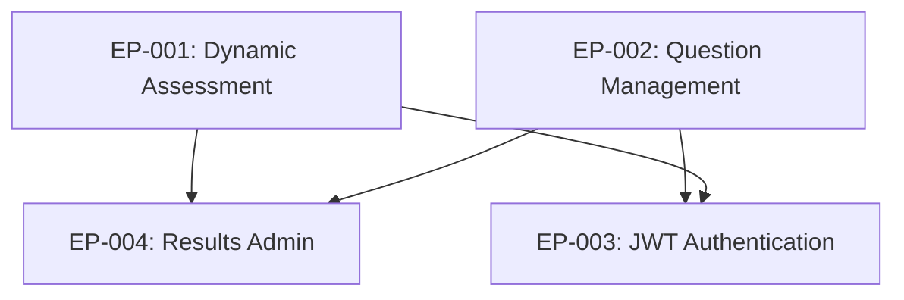

# Epic Overview

This document provides high-level descriptions and status of all project epics. For detailed task status, see `pm_status.md`. For specific task requirements, see individual task files.

## Epic Status Indicators
- 🔴 TODO
- 🟠 In Progress 
- 🟢 Completed
- ⚠️ Blocked

---

## 🟠 EP-001: Implement Dynamic Initial Assessment for Educators

**Status:** In Progress (87% complete)
**Priority:** High
**Timeline:** Started May 2025, Expected completion: January 2026

### Overview
Create a comprehensive initial assessment system for educators that dynamically adjusts difficulty based on performance and establishes personalized learning paths. This forms the foundation of the adaptive learning experience.

### Business Value
- Enables accurate identification of knowledge gaps and strengths
- Provides truly personalized professional development recommendations
- Establishes baseline for measuring educator growth over time
- Creates data-driven approach to professional development planning

### Key Features
- 40-question adaptive assessment with 6 difficulty levels
- Weighted selection across 10 ECE domains
- Real-time difficulty adjustment based on performance
- Server-authoritative timer system with automatic progression
- Comprehensive results analysis with growth area identification
- Personalized learning path generation with domain prioritization

### Success Criteria
- ✅ Assessment dynamically adjusts difficulty (6 levels) ✅ ACHIEVED
- ✅ Results identify knowledge gaps across 10 weighted ECE domains ✅ ACHIEVED  
- ✅ System generates personalized learning paths ✅ ACHIEVED
- ✅ Assessment completion triggers achievements/rewards ✅ ACHIEVED
- ✅ Data securely stored for long-term progress tracking ✅ ACHIEVED
- ✅ 40-question assessment completes in 30-40 minutes ✅ ACHIEVED
- ✅ Eligible educators can complete assessment exactly once ✅ ACHIEVED
- 🟦 Frontend integration and dashboard personalization IN PROGRESS

### Current Phase
**Backend Complete**: Core assessment system, adaptive algorithms, and data processing fully implemented. **Frontend Integration**: User interfaces and dashboard personalization in progress.

---

## 🟠 EP-002: Admin UI for Question Management System

**Status:** In Progress (60% complete)
**Priority:** Medium
**Timeline:** Started November 2025, Expected completion: February 2026

### Overview
Create a comprehensive Admin UI system for managing assessment questions, their answers, mini-lessons, and associated educational content. Enables content managers to perform CRUD operations and maintain educational quality.

### Business Value
- Enables efficient content management for assessment scaling
- Provides quality control through approval workflows
- Allows school-specific customization of question availability
- Supports rapid content creation through AI-assisted generation

### Key Features
- Full CRUD interface for assessment questions
- AI-powered question generation with ECE expertise
- Question approval workflow with role-based access
- Platform and school-level availability controls
- Domain assignment and difficulty management
- Mini-lesson content management and linking

### Success Criteria
- ✅ Content managers can create, read, update, delete questions ✅ ACHIEVED
- ✅ AI-powered question generation functional ✅ ACHIEVED
- ✅ Role-based access controls implemented ✅ ACHIEVED
- ⬜ Question approval workflow with proper controls
- ⬜ Platform/school-level availability management
- ⬜ Complete mini-lesson content management system

### Current Phase
**Core CRUD Complete**: Basic question management and AI generation implemented. **Advanced Features**: Approval workflows and availability controls pending.

---

## 🔴 EP-003: JWT Authentication & Authorization System

**Status:** TODO (0% complete)
**Priority:** High (Security Critical)
**Timeline:** Planned start: January 2026, Expected completion: March 2026

### Overview
Replace current hardcoded password authentication with secure JWT-based system. Critical for production security and proper role-based access control across the platform.

### Business Value
- Eliminates security vulnerabilities from hardcoded passwords
- Provides proper authentication for production deployment
- Enables granular role-based permissions system
- Supports scalable multi-role user management

### Key Features
- JWT token generation and validation infrastructure
- Comprehensive role-based permission system
- Secure admin login interface with optional 2FA
- Token management and session control
- Migration from password-based to token-based authentication
- Security hardening and compliance audit

### Success Criteria
- JWT tokens properly generated, signed, and validated
- Role-based permissions control access to features
- Admin interfaces use secure authentication
- All endpoints migrated from password to JWT validation
- Security audit passes with industry standards
- System ready for production deployment

### Current Phase
**Planning**: Architecture and security requirements defined. **Blocked**: Waiting for EP-001 completion to avoid integration conflicts.

---

## 🔴 EP-004: Admin UI for Assessment Results

**Status:** TODO (0% complete)
**Priority:** Low
**Timeline:** Planned start: March 2026, Expected completion: April 2026

### Overview
Create comprehensive administrative interfaces for managing and analyzing assessment results across the platform. Provides administrators with powerful tools for monitoring and analytics.

### Business Value
- Enables platform administrators to monitor assessment effectiveness
- Provides data-driven insights for educational decision making
- Supports quality assurance of the assessment system
- Creates foundation for advanced analytics and reporting

### Key Features
- Comprehensive assessment results management interface
- Advanced filtering and search capabilities across all results
- Performance analytics and growth area identification
- Data export capabilities for further analysis
- Integration with existing admin interface patterns

### Success Criteria
- Administrators can view and filter all assessment results
- Results display provides meaningful performance insights
- Interface maintains consistency with existing admin patterns
- Performance remains acceptable with large datasets
- Data export capabilities functional for reporting

### Current Phase
**Dependencies**: Waiting for EP-001 completion (assessment results data) and EP-002 patterns (admin interface consistency).

---

## Epic Dependencies

### Dependency Notes
- **EP-003 depends on EP-001**: Avoid authentication changes during core assessment development
- **EP-003 depends on EP-002**: JWT system must handle admin interfaces properly  
- **EP-004 depends on EP-001**: Requires assessment results data structure
- **EP-004 depends on EP-002**: Leverages admin interface patterns and components

---

## Strategic Roadmap

### Phase 1 (Current): Core Assessment System
**Focus**: Complete EP-001 dynamic assessment system
**Goal**: Functional end-to-end assessment experience for educators
**Timeline**: Through January 2026

### Phase 2: Security & Authentication  
**Focus**: Complete EP-003 JWT authentication system
**Goal**: Production-ready security infrastructure
**Timeline**: January - March 2026

### Phase 3: Admin Capabilities Enhancement
**Focus**: Complete EP-002 and EP-004 admin features
**Goal**: Full content management and analytics capabilities
**Timeline**: February - April 2026

### Phase 4: Future Expansion
**Focus**: Additional epics for advanced features
**Goal**: Enhanced user experience and platform capabilities
**Timeline**: April 2026+ 